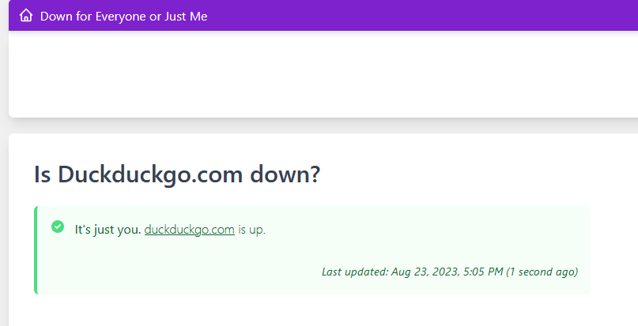

Every js file is a bookmarklet.\
Add the code in the js file as a bookmark link and click it on a site

# Bookmarklets

## DevopsMarkRetainedBuilds
Will mark all builds on screen which have retained flag. This will be more visible then the small pin.

## DownForAll
Will redirect to downforeveryoneorjustme.com for the site you are currently on

## EnableRightClick
Will enable right click on sites where they disable it. Should work mostly.

## HideInstagramLogonPage
Hides the logon page on an instagram profile when trying to scroll down to view more.
Will allow you to scroll but not click

## SpongebobMock
WiLl sHoW InPuT PoPuP AnD PuT MoCk tExT In cLiPbOaRd

For some reason clipboard writetext doesn't always work, haven't figured out why yet.

## _tryouts

# Links
[Create Bookmarklets](http://mrcoles.com/bookmarklet)\
[Test javascripts](http://jsfiddle.net)